# 魔術師 (SD31-based) 牌組介紹

## 前言
眾所皆知其實 ```魔術師```、```EM```、```異色眼```、```霸王龍-zarc -based``` 這4個系統是可以相互支援的 (ARC-V動畫裡面都是番茄用的牌)。

而本篇則主要是要介紹以 ```SD31 魔術師``` 為基礎所組成的「 **演牌型**」 靈擺牌組  (以下簡稱 ```SD31-based 魔術師``` ) ，即是賽場中被歸類為 ```魔術師``` 這個類別的牌組最常用的古架。 

(至於技剝強攻型的玩法，筆者不太熟，可能要去猜考別篇)

```SD31-based 魔術師``` 在2018年當  **沉鍊裝勇士-琥珀金(銀金公主)** 未被限一、 **水晶機巧-哈里纖維** 還健在以及 **宙讀的魔術士** 、 **刻讀的魔術士** 這兩張廚牌未被限一之時曾經在餅圖上佔有一席之地，是它最風光的時期。

如今隨著上述夥伴的殘廢，以及單卡動+一堆手坑 (即使是演牌也是) 這種較為穩定、有彈性的牌組當道，這副在現在已經變成高手 (非筆者，筆者還太廢，無法) 限定或偷上位的牌型。如果不是有興趣或很有愛(筆者屬於後者)，不建議打演牌向 ```SD31-based 魔術師``` :

### -- 以下勸退文 --
如果是新手(剛入坑)，或是要求穩定的玩家，極度不推薦使用本篇提供的做法，原因如下:
1. ( Fresh man ) P牌一張有兩個效果 : 魔法效果以及怪獸效果。如果是依靠P召來展開的牌組，基本上每張牌的兩個效果都要記，要記得的太多。
   
2. ( Fresh man ) 想要以背公式演導向的打法的話，實戰時幾乎不太會成功，然後就打不贏，新手接觸後打完match有可能會變得跟動畫中使用這副牌的人一樣。
   
3. 我想這應該是由於這副的古架 (SD31) 實在太老了，無法像龍劍士那樣少卡開演，是以不太穩定。筆者認為其實這副牌要當演牌打的話要 **5卡動** 。不是說要特定的那5張，而是不同的5張會使你使用不同的做法。
   
4. 以下情況有極高的機率會使你輸掉這場對局: 
   1. 中G 
   2. 中隕石 
        
        演牌向的 ```SD31-based 魔術師``` 如果要用P後鮮花防隕石，那陣就會比較小，以現在其他單卡動+手坑的牌來說，小擋等於沒有擋，然後對手就會踩過去，然後就輸了。

   3. 中2坑(手牌沒有很好的情況)
       
       e.g. 無效系給銀金，灰流給小丑或星刻 $\to$ 沒有資源+演不動 $\to$ 輸

       想哭。
    
    4. 中 次元障蔽
        
        無法，儀式、F、S、X、P的原罪。 

    5. 中 冥王結界波/一滴/太陽蛋/熔炎魔神
   
        超級絕望，但應該有預兆。
        看到第二把一直演然後對手像是牆壁，就大概知道了。
        
        冥王結界波或是一滴(他沒有丟陷阱卡為代價的話) 有機會可以出No.22 來避免 (有錢的話)，後面配合卡的部分會提到。
        
        (就是連鎖自己的紅陣(陷阱)然後開效果點掉J波/一滴)
   
    聽起來就是幾乎在BO3的賽場上一定會輸。
    
    所以筆者其實覺得想要用演牌型的 ```SD31-based 魔術師``` 去打賽場要不是很有愛，就是想去靠賽。 

**-- 請記住，只有真正的「魔術師」(限一的上手率看起來像是沒有限制，然後把對手切到都抽不到坑的那種) 才有能力使用魔術師起舞 --**
   
## 單卡介紹
這副牌的字段有很多 (4大類):
    
    魔術師
    EM (娛樂夥伴)
    異色眼
    靈擺

- 不會全部有該些字段的牌都講，只講 ```SD31-based 魔術師``` 構成所用到的。

- 有些牌一次會帶1個以上的字段，記起來ㄏ累。

- 魔術師主要是透過 **P一排是4星P怪** 來展開，而其刻度為 8(高刻度) 或 1、2 (低刻度)。

- 怪獸最正確的體質為 4星 暗屬性 魔法使族 。

### SD31 四天龍人形化

<h4 id="rainbow"></h4>

#### 虹彩的魔術師 (魔術師、靈擺)
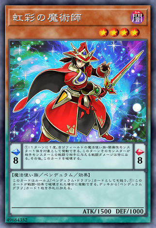

|暗|魔法使族|L4|ATK 1500|DEF 1300|
|-|-|-|-|-|

效果:
```
擺動刻度：左8右8

擺動效果：
1回合1次，可以我方場上1體魔法使族、闇屬性怪獸為對象發動。
此回合該怪獸和對手怪獸進行戰鬥給予對手的戰鬥傷害加倍。
之後，此卡破壞。

怪獸效果：
此卡在規則上視為「靈擺龍」之名的卡片。
此卡被戰鬥、卡片效果破壞的場合可以發動。
從牌組將1張「靈擺讀陣」之名的卡片加入手札。
```

魔法效果給跟怪打戰傷兩倍不是重點(雖然偶爾能靠這個搶血打死)，由於**發動之後會自爆**，進而觸發自己的強力怪獸效果，才是重點。

一定要砍半後才會自爆，所以對象消失，就變成不能處理給打兩倍的效果而卡住。

要注意由於是讓戰傷變兩倍，所以 **「沒有戰階不能開」** (e.g. 先攻。對，先手那回合沒有戰階，雖然陣很強，但還是不要口糊別人比較好)

怪獸效果在被破壞後能檢索「靈擺讀陣」(沒有一回合一次，能炸幾次就能檢幾張)。目前能檢索的有這兩張:

- 永續魔法 [***星霜的靈擺讀陣***](#g_formation) (綠陣) : 是重要的資源產生點

- 永續陷阱 [***時空的靈擺讀陣***](#r_formation) (紅陣) : 是終端之一

上述兩張都能藉由虹彩被炸掉而從牌組檢索出來，故放2~3 (本篇牌組放3)。

所以先手展開的過程有個重要任務是**炸虹彩找陣**。

此外要注意他在規則上名字視為「**靈擺龍**」(效果外文本) (異色眼靈擺龍人形化)，所以他也帶有「靈擺」這個字段。當對手想檢舉你亂檢索時記住不要被騙到。

<h4 id="blacktooth"></h4>

#### 黑牙的魔術師 (魔術師)
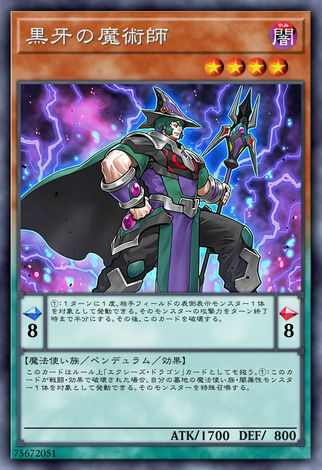

|暗|魔法使族|L4|ATK 1700|DEF 800|
|-|-|-|-|-|

效果:
```
擺動刻度：左8右8
擺動效果：
1回合1次，可以對手場上1體表側表示怪獸為對象發動。
到回合結束以前該怪獸的攻擊力減半。
之後，此卡破壞。

怪獸效果：
此卡在規則上視為「超量龍」之名的卡片。
此卡被戰鬥、卡片效果破壞的場合，可以我方墓地1體魔法使族、闇屬性怪獸為對象發動。
該怪獸特殊召喚。
```

魔法效果點別人砍半然後自爆，都很重要，不過自爆更重要，會觸發強力怪獸效果。
砍半使你有機會直接通召打爆一些定場怪，e.g. 米德拉什 或 滑板人。

一樣，對象要砍半攻擊力才會自爆 (0也可以砍半)，所以如果對象消失或是對象不受影響之類的狀況就不會自爆。

怪獸效果被炸能復活墓地暗魔法使，是本篇展開方式所倚賴的重要效果，也是沒有一回合一次，所以炸幾次就能拉幾次，展開時常常需要炸他來增加怪的數量，極為重要，所以放3。 

** 有人會覺得先攻抽太多卡(對面沒有怪給你點)，所以只放2，第3張放備邊。

(由此可知其實深淵獸或DD烏鴉對 ```SD31-based 魔術師``` 是有干擾能力的。)

規則上視為「**超量龍**」 (暗叛逆超量龍人形化)

<h4 id="purplepoison"></h4>

#### 紫毒的魔術師 (魔術師、靈擺)
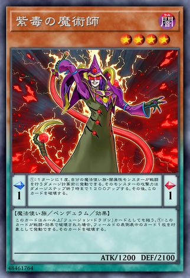

|暗|魔法使族|L4|ATK 1200|DEF 2100|
|-|-|-|-|-|

效果:
```
擺動刻度：左1右1
擺動效果：
1回合1次，我方場上的魔法使族、闇屬性怪獸進行戰鬥的傷害計算以前可以發動。
到傷害步驟結束以前該怪獸的攻擊力上升1200。
之後，此卡破壞。

怪獸效果：
此卡在規則上視為「融合龍」之名的卡片。
此卡被戰鬥、卡片效果破壞的場合，可以場上1張表側表示的卡片為對象發動。
該卡片破壞。
```
魔法效果讓暗魔法使在打人時攻擊力+1200，也有機會拿來使得通召一隻打敗小米，算蠻強的。重點是會自爆，讓這個效果威脅大增。

怪獸效果被炸可以炸掉一張表側卡，本家解場用，當他貼在P區後用暗魔法使打別人可藉由其魔法+怪獸效果可以拆別人2張，筆者認為很強。
配合[紅陣](#r_formation)亦能換掉2張，總之就是本家強力解場。

大屁屁，很卡很卡的場合也能set 下去讓別人打，就算被打掉也有機會帶走別人一張。

小機率會拿來炸自己(e.g. 炸虹彩 或 黑牙) 幫助展開。

直入3

規則上視為「融合龍」(飢餓毒融合龍人形化)

<h4 id="whitewing"></h4>

#### 白翼的魔術師 (魔術師)
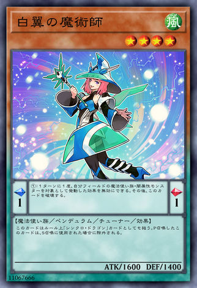

|風|魔法使族|協調|L4|ATK 1600|DEF 1400|
|-|-|-|-|-|-|

效果:
```
擺動刻度：左1右1
擺動效果：
1回合1次，可以將以我方場上的魔法使族、闇屬性怪獸作為對象的卡片效果無效。
之後，此卡破壞。

怪獸效果：
此卡在規則上視為「同步龍」之名的卡片。
擺動召喚出場的此卡用於同步召喚的場合除外。
```

**廢牌，會講只是因為要湊齊4天龍**

體質歪掉，效果又不能賺牌，魔法效果看似可以幫暗魔擋指定，但這副牌最怕泡影的地方是銀金公主，根本幫不上忙。
怪獸效果就是個笑話，除了副作用以外沒有其他的正面效益。唯一的賣點是他是4星協調，不過水機被禁了，所以目前一般不投入。

幫他講點好話，這副牌的另外一隻協調 [**調弦的魔術師**](#tuning) 只能跟有 魔術師 字段的其他人做為 S F X 的素材，而如果想要跟[刻讀的魔術士](#chorno)同步出鮮花，可以靠他。還有他的外表較為女性化，看到會比較開心。

另外要注意，他的魔法效果是不入連鎖的，在可以適用的效果處理到時直接讓其無效就好。

總之，因為規則上視為「同步龍」(幻透翼同步龍人形化)，所以除非是要玩花式霸王龍Z-arc 軸的，不然一般不用放。

**上述紅黑紫白的魔法效果都沒有綁名字一回合一次，複數張貼上去能用複數次**

**而怪獸效果更沒有一回合一次，舉個例子 : 場上紫毒被破壞送額外後點鮮花，先花把他「無效並破化」，所以紫毒被破壞進墓地了。因為他被破壞，所以發動點鮮花炸掉，然後對手的鮮花還是一樣GG**


### SD31 被限一的難兄難弟

<h4 id="astral"></h4>

#### 宙讀的魔術士(讀星魔術士)
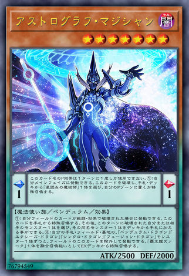

|暗|魔法使族|L7|ATK 2500|DEF 2000|
|-|-|-|-|-|

效果:
```
擺動刻度：左1右1
擺動效果：
「讀星魔術士」的擺動效果1回合僅能使用1次。
我方的主要階段時可以發動。
此卡破壞，從手札、牌組選擇1體「星讀的魔術師」設置在擺動區域或是特殊召喚。

怪獸效果：
(1)：
我方場上的卡片被戰鬥、卡片效果破壞的場合可以發動。
從手札將此卡特殊召喚。
之後，可以從牌組選擇1體此回合被破壞的怪獸的同名怪獸加入手札。
(2)：
可以將場上的此卡除外，從我方手札、場上、墓地將
「擺動龍」「超量龍」「同步龍」「融合龍」之名的怪獸各1體除外發動。
從額外牌組將1體「霸王龍Z-ARC」視為以融合召喚方式特殊召喚。
```
魔法效果能從牌組直接帶出[星讀的魔術師](#astral_magician)，要設置或跳出來皆可，強。

怪獸效果是這副牌賺牌的關鍵，每當我方場上有卡被炸就能「手牌誘發」，並可以檢索這回合有被炸過的怪獸。

我方靈擺區卡片被炸掉後，也算在「這回合有被炸過的怪獸」裡面。

怪獸效果<ins>**沒有一回合一次**</ins>，所以，此篇Combo 展開就是透過不斷觸發宙讀效果，進而增怪+賺牌，是這副裡面過勞的怪獸。

注意，這種「這回合有被炸過的怪獸」的判例是**那張** (不是那個名字) 卡被炸完後不能離開被炸的地方，不然那張卡的標籤會被重置，「被炸過」標籤被撕掉，宙讀會看不到，而不能檢索他。

    e.g : 
    慧眼從P區被破壞後，那張慧眼再被P召出來。
    之後其他卡被破壞觸發手上宙讀效果處理時，
    由於那張慧眼被重置過，
    所以不能因為那張慧眼這回合有被破壞過而檢索牌組裡慧眼。

    (但如果有其他張沒有被重置過的慧眼有在清單裡面
    ，則依舊能夠檢所慧眼)

至於出霸王龍的那個效果賽場上幾乎不會也沒辦法用到，是為了還原動畫效果用的。當然，當娛樂向使用也行。

<h4 id="chorno"></h4>

#### 刻讀的魔術士(讀時魔術士)
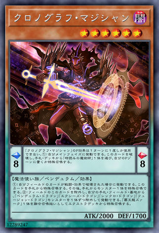

|暗|魔法使族|L6|ATK 2000|DEF 1700|
|-|-|-|-|-|

效果:
```
擺動刻度：左8右8
擺動效果：
「讀時魔術士」的擺動效果1回合僅能使用1次。
我方的主要階段時可以發動。
此卡破壞，從手札、牌組選擇1體「時讀的魔術師」設置在擺動區域或是特殊召喚。

怪獸效果：
(1)：
我方場上的卡片被戰鬥、卡片效果破壞的場合可以發動。
從手札將此卡特殊召喚。
之後，可以從手札將1體怪獸特殊召喚。
(2)：
可以將場上的此卡除外，從我方手札、場上、墓地將
「擺動龍」「超量龍」「同步龍」「融合龍」之名的怪獸各1體除外發動。
從額外牌組將1體「霸王龍Z-ARC」視為以融合召喚方式特殊召喚。　
```

基本上就是相對應宙讀的另外一隻魔術士，只是他是帶手牌怪，特定的手牌組合或是場上怪不夠需要從手牌跳的時候會改檢索他而非宙讀。

**要注意這兩張廚牌都沒有魔術師字段，所以[綠陣](#g_formation)不能拿它們；刻讀也不能跟[調弦](#tuning)同步出鮮花女爵。**

### 其餘的魔術師們

<h4 id="peehole"></h4>

#### 慧眼的魔術師 (魔術師)

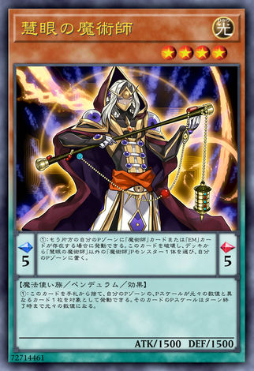

|光|魔法使族|L4|ATK 1500|DEF 1500|
|-|-|-|-|-|

效果:
```
擺動刻度：左5右5
擺動效果：
我方主要階段時，若我方另一邊的擺動卡區存在
「魔術師」或「EM」之名的卡片則可以發動。
此卡破壞，從我方牌組將1體「慧眼的魔術師」以外的
「魔術師」之名的擺動怪獸放置在我方的擺動卡區。

怪獸效果：
我方主要階段時，可以從我方手札捨棄此卡，
選擇我方擺動卡區1張擺動刻度和原數值相異的卡片為對象發動。
到回合結束時為止該卡片的擺動刻度變為原數值。
```

怪獸效果幾乎用不到。

魔法效果極強，是這副牌調度刻度的關鍵，另一邊是低刻度，就用他拉出高刻度，反之亦然。

或是想要用特定隻的魔法效果時，也可以使用他拉上來使用 :

- 想拿紅綠陣拉[虹彩](#rainbow)，解場拉[紫毒](#purplepoison)，復活拉[黑牙](#blacktooth)(當然也要看另一邊的刻度是多少)。

他是直接從牌組set ，不吃灰流，不要被騙。

由於發動完會自炸，能觸發手上的[宙讀](#astral)/[刻讀](#chorno)效果。如果觸發到宙讀，則可以拿第二張慧眼(慧眼沒有一回合一次)，強。

(Note : 手牌誘發我方一個連鎖串只能開一個，所以不能宙讀接刻讀這樣開。)

配合[綠陣](#g_formation)更有機會一次把需要的材料湊到位，相當強力。

直入3

<h4 id="tuning"></h4>

#### 調弦的魔術師 (魔術師)
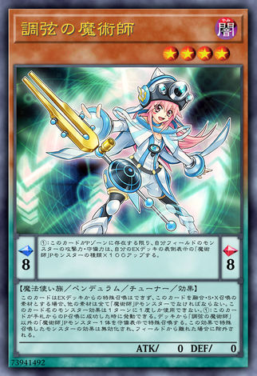

|暗|魔法使族|協調|L4|ATK 0|DEF 0|
|-|-|-|-|-|-|

效果:

```
擺動刻度：左8右8
擺動效果：
此卡於擺動區域存在為限，我方場上所有怪獸的
攻擊力、守備力上升我方額外牌組表側表示的
「魔術師」之名的擺動怪獸的種類數×100。

怪獸效果：
此卡不能從額外牌組特殊召喚、
作為融合、同步、超量素材的場合，
其他素材必須全為「魔術師」之名的擺動怪獸。
「調弦的魔術師」的怪獸效果1回合僅能使用1次。
此卡從手札擺動召喚成功時可以發動。
從牌組將1體「調弦的魔術師」以外的
「魔術師」之名的擺動怪獸以守備表示特殊召喚。
以此效果特殊召喚的怪獸效果無效化，離場的場合除外。
```
魔法效果就加攻守，對於換資源沒什麼用，但要回殺時進戰階之前可以把他貼上去增加總體傷害。

一個有趣的現象是定場怪會因為他在刻度而攻擊力超過3000，在對某些對局會有莫名的作用。 

對於2擋神弓，攻擊力可能會到2000，這有可能會打亂想要不踩到任何一擋就想用戰破來過神弓的對手的計策。 (但遇到恐摔 或 獸王 還是死QQ)


怪獸效果為展開關鍵，P 召成功就能從牌組拉魔術師，通常希望可以P 他 (注意他只能從手上 P，所以如果他在額外，可以使用[賤龍](#discard_dragon)把他撿回手)。可以拉4星來同步超量，P 的夠多的情況可以考慮拉6星來同步鮮花女爵去護航。

展開成功與否的關鍵，直入3

要記得要以他做素材進行 S F X，其他人一定要有魔術師字段的 P怪，所以不能用他+[老爸](#dad)或[小丑](#joker)出泥睡或8星同步，也不能用他+[刻讀](#chorno)做鮮花。 

<h4 id="discard_dragon"></h4>

#### 賤龍的魔術師 (魔術師)
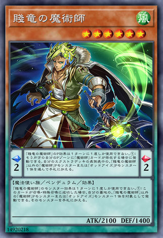

|光|魔法使族|L6|ATK 2100|DEF 1400|
|-|-|-|-|-|

效果:
```
擺動刻度：左2右2
擺動效果：
「賤龍的魔術師」的擺動效果1回合僅能使用1次。
我方另一邊的擺動區域有「魔術師」之名的卡片存在的場合可以發動。
從我方額外牌組選擇1體表側表示的「賤龍的魔術師」以外的
「魔術師」或是「異色眼」之名的擺動怪獸加入手札。

怪獸效果：
「賤龍的魔術師」的怪獸效果1回合僅能使用1次。
此卡召喚、特殊召喚成功的場合，可以我方墓地1體「賤龍的魔術師」以外的
「魔術師」之名的擺動怪獸或是「異色眼」之名的怪獸為對象發動。
該怪獸加入手札。
```

魔法效果很重要，可以回收額外表側的 魔術師 或 異色眼，可以把[慧眼](#peehole)拿回來以利後續使用；或是拿一隻回手藉此多P一隻怪下來 (大師規則 2020 下 P牌的悲哀)。

怪獸效果就看情況，若P出來有需要回收的東西就發。

特別注意他是6星，可以跟 [調弦](#tuning) 或 [白翼](#whitewing) 變成鮮花女爵 (時常用的護航手段之一)
；或是跟[EM異色眼同步](#egg)者變成槍管S龍或爆龍劍士。

總之他是P效果強力，同時等級又不錯的支援牌。

放3 

<h4 id="EMsky"></h4>

#### EM天空的魔術師 (EM、魔術師)
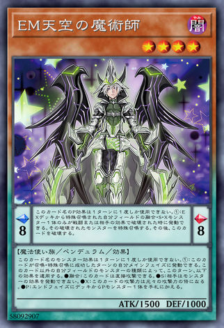

|暗|魔法使族|L4|ATK 1500|DEF 1000|
|-|-|-|-|-|

效果:
```
擺動刻度：左8右8
擺動效果：
此卡名的擺動效果1回合僅能使用1次。
僅1體從額外牌組被特殊召喚到我方場上的
融合、同步、超量怪獸
被戰鬥或是對手的卡片效果破壞時可以發動。
該被破壞的怪獸特殊召喚。
之後，此卡破壞。

怪獸效果：
此卡名的怪獸效果1回合僅能使用1次。
此卡召喚、特殊召喚成功的回合的我方主要階段時可以發動。
此回合，依據此卡以外的我方場上的怪獸的種類適用以下效果。
●融合：此卡可以直接攻擊。
●同步：對手不能發動怪獸效果。
●超量：此卡的攻擊力變為原攻擊力的2倍數值。
●擺動：結束階段時從牌組將1體擺動怪獸加入手札。
```

魔法效果是續命用的。
例如當我方泥睡魔獸被對方炸掉進墓地時，就能使用在P區的他把泥睡復活起來，繼續擺爛。

定完場之後如果可以也能放一隻這個在P區，讓那些定場怪萬一不幸被炸掉或戰破，可以用他復活起來再苟一下。

怪獸效果是喊完之後，依據效果處理當下的種類分別適用(有兩種就可以得到對應的兩個效用，有3種就可以得到對應的3種效用，以此類推)

主要看兩個 : 有其他靈擺怪 跟 同步怪的那兩個。靈擺怪是結束階段檢一張P卡，算是賺牌的一種方式，這副通常拿來檢索刻讀、小丑、超天新龍，下回合使用(~~如果沒有被幹死的話~~)。

若在處理時有同步怪，處理完後即進入大外神模式，再也不需要擔心對方怪獸效果了。
中G想要回殺也可先出同步怪並喊此效果，若喊成功則可以避面其他怪獸手坑 。

(~~然後就被3張泡影砸死了~~)

通常放 1~2 

#### 七爺八爺  

<h4 id="astral_magician"></h4>

#### 星讀的魔術師
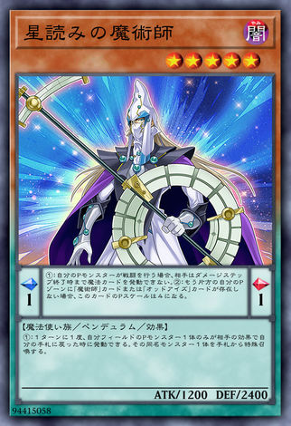

|暗|魔法使族|L5|ATK 1200|DEF 2400|
|-|-|-|-|-|

效果:
```
擺動刻度：左1右1
擺動效果：
(1)此卡表側表示存在擺動卡區為限，若我方的擺動怪獸進行戰鬥，
對方直到傷害步驟結束時為止不能發動魔法卡。
(2)若我方另一邊的擺動卡區不存在「魔術師」或「異色眼」之名的卡片，
此卡的擺動刻度變為4。

怪獸效果：
(1)1回合1次，我方場上的1體擺動怪獸被對方卡片效果回到手札時可以發動。
從手札特殊召喚1體和回到手札的怪獸同名的怪獸。
```

廢件1號。當刻度另一邊不是魔術師或異色眼有副作用，意義在哪? 

不希望抽上來，放他只是拿來給[宙讀](#astral)調度。

<h4 id="chorno_magician"></h4>

#### 時讀的魔術師 (魔術師)
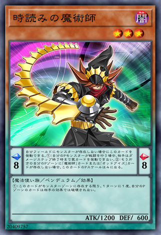

|暗|魔法使族|L3|ATK 1200|DEF 600|
|-|-|-|-|-|

效果:
```
擺動刻度：左8右8
擺動效果：
若我方場上不存在怪獸則可以發動此卡。
(1)此卡表側表示存在擺動區為限，若我方的擺動怪獸進行戰鬥，
對方直到傷害步驟結束時為止不能發動陷阱卡。
(2)若我方另一邊的擺動區不存在「魔術師」或「異色眼」之名的卡片，
此卡的擺動刻度變為4。

怪獸效果：
(1)此卡表側表示存在怪獸卡區為限，1回合1次，我方擺動區的卡不會被對方卡片效果破壞。
```

廢件2號，還是很廢很廢的那種。

場上有怪不能貼P，另一邊不是魔術師或異色眼又有副作用，超廢，超不希望抽上來，放他只是拿來給[刻讀](#chorno)調度。

### EM & 異色眼

<h4 id="dad"></h4>

#### EM靈擺魔術士 (EM 靈擺)
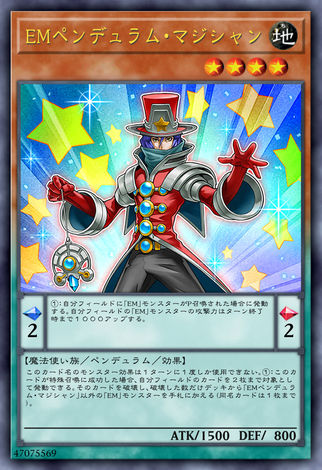

|地|魔法使族|L4|ATK 1500|DEF 800|
|-|-|-|-|-|

效果:
```
擺動刻度：左2右2
擺動效果：
我方場上有「EM」之名的怪獸擺動召喚的場合發動。
到回合結束以前我方場上所有「EM」之名的怪獸的攻擊力上升1000。

怪獸效果：
「EM擺動魔術士」的怪獸效果1回合僅能使用1次。
此卡特殊召喚成功的場合，可以我方場上最多2張卡片為對象發動。
該卡片破壞，從牌組將被破壞的卡片數量的「EM擺動魔術士」以外
的「EM」之名的怪獸加入手札（同名卡片最多1張）。
```

俗稱老爸，因為長的很像ARC-V裡面番茄(主角，同時他也是用這副牌)他爹。

魔法效果要注意，是必發，能發的場合要先喊1 (~~不然會被雞掰人檢舉~~)。不太重要，不過偶爾對方空場時能夠憑藉這個效果把對方推死。

怪獸效果ㄏ賺，通常都會選炸2檢索2，炸到[虹彩](#rainbow)能夠觸發檢[陣](#formation)，[黑牙](#blacktooth)復活，[紫毒](#purplepoison)炸場等等，賺。

要注意他本身也有「靈擺」這個字段

直入3

<h4 id="joker"></h4>

#### EM骷髏雜技小丑 (EM)
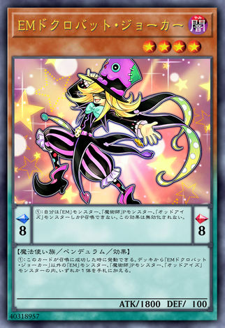

|暗|魔法使族|L4|ATK 1800|DEF 100|
|-|-|-|-|-|

效果:
```
擺動刻度：左8右8
擺動效果：
我方僅能擺動召喚「EM」之名的怪獸、
「魔術師」之名的擺動怪獸、「異色眼」之名的怪獸。
此效果不會被無效化。

怪獸效果：
此卡召喚成功時可以發動。
從牌組的「EM」之名的怪獸、
「魔術師」之名的擺動怪獸、「異色眼」之名的怪獸
之中選擇1張「EM骷髏蝙蝠小丑」以外的卡片加入手札。　
```

魔法效果要注意會限制只能P EM 魔術師 異色眼。

怪獸效果簡單爆力，就檢索他能P的那3個字段，是本副牌的通召點。

直入3

<h4 id="egg"></h4>

#### EM異色眼同步者 (EM 異色眼)

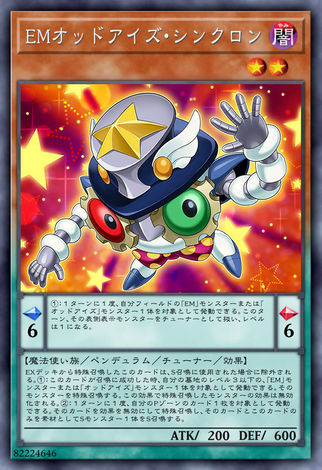

|暗|魔法使族|協調|L2|ATK 200|DEF 600|
|-|-|-|-|-|-|

效果:
```
擺動刻度：左6右6
擺動效果：
1回合1次，可以我方場上1體「EM」或是「異色眼」之名的怪獸為對象發動。
此回合，該表側表示怪獸視為協調，等級變為1。

怪獸效果：
從額外牌組特殊召喚出場的此卡作為同步召喚使用的場合除外。
(1)：
此卡召喚成功時，可以我方墓地1體等級3以下的
「EM」或是「異色眼」之名的怪獸為對象發動。
該怪獸特殊召喚。
以此效果特殊召喚的怪獸的效果無效化。
(2)：
1回合1次，可以我方擺動區域1張卡片為對象發動。
該卡片效果無效並特殊召喚，僅以該卡片和此卡作為素材將1體同步怪獸同步召喚。
```

算上是廢件，只是抽上來不會跟七爺八爺一樣那麼幹。理想的上手情況是透過[老爸](#dad)把他檢索上來。

魔法效果偶爾可以把場上EM字段轉成1星協調，跟[宙讀](#astral)變成槍管S龍。

本身就是協調，怪獸效果則通常是拿來他P區的[賤龍](#discard_dragon)做槍管S龍；或跟P區[異色眼融變者](#oddeyes_fusionguy)做鮮花女爵。

放1

<h4 id="oddeyes_fusionguy"><h4>

#### EM異色眼融變者 (EM 異色眼)

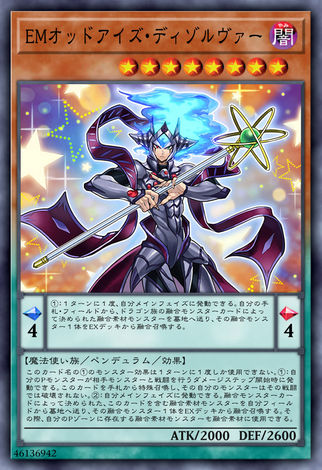

|暗|魔法使族|L8|ATK 2000|DEF 2600|
|-|-|-|-|-|

效果:
```
擺動刻度：左4右4
擺動效果：
1回合1次，我方主要階段時可以發動。
從我方手札、場上將龍族融合怪獸卡上決定的融合素材怪獸送入墓地，從額外牌組將該1體融合怪獸融合召喚。
怪獸效果：
此卡名的(1)怪獸效果1回合僅能使用1次。
(1)：
我方的擺動怪獸和對手怪獸進行戰鬥的傷害步驟開始時可以發動。
從手札將此卡特殊召喚，該我方怪獸不會被該次戰鬥破壞。
(2)：
我方主要階段時可以發動。
從我方場上將包含此卡的融合怪獸卡上決定的融合素材怪獸送入墓地，從額外牌組將該1體融合怪獸融合召喚。
此時，我方擺動區域存在的融合素材怪獸可以當作融合素材使用。　
```

有帶異色眼風雷龍的才會帶，不然一般不會帶，因為8星這副根本P不下來，刻度4極度爛。

基本上本篇的Combo 會用到的就是先堆他下去再用魔皇后把他拉起來，並使用他的怪獸效果出風雷龍一擋。如果狀況允許(場面較好)，會直接用[老爸](#dad)檢索他跟[EM異色眼同步者](#egg)，在把他貼上P區發融合效果，使用手上的[EM異色眼同步者](#egg)+其他P怪出風雷龍。

擋戰破的效果就筆者而言蠻常用到的，後手把[小丑](#joker)+[紫毒](purplepoison)去撞人，順便把他跳出來打人，主二就先變風雷龍護航或是link成銀金/軌跡等。

要放通常只放1，因為起手抽上來真的很卡。

### 龍 P 怪小系統
<h4 id="revolutionary"><h4>

#### 超天新龍-異色眼革命龍 (異色眼)

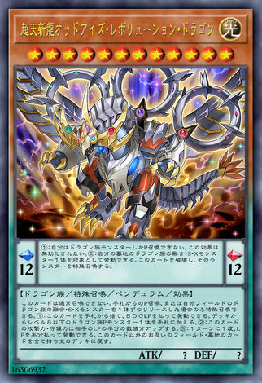

|光|龍族|L12|ATK ?|DEF ?|
|-|-|-|-|-|

效果:
```
擺動刻度：左12右12
擺動效果：
(1)：
我方僅能擺動召喚龍族怪獸。
此效果不會被無效化。
(2)：
可以我方墓地1體龍族的融合、同步、超量怪獸為對象發動。
此卡破壞，該怪獸特殊召喚。

怪獸效果：
此卡不能通常召喚。
僅能以從手札的擺動召喚，或是解放我方場上的龍族的融合、同步、超量怪獸各1體才能特殊召喚。
(1)：
可以從手札捨棄此卡，並支付500分生命值發動。
從牌組將1體等級8以下的龍族擺動怪獸加入手札。
(2)：
此卡的攻擊力、守備力上升對手的生命值的一半數值。
(3)：
1回合1次，可以支付一半生命值發動。
除此卡以外雙方場上、墓地的所有卡片返回持有者牌組。
```

魔法效果能復活墓地的龍 FSX，就是搶救本副牌的大怪們。
可以把No.38 或是 風雷龍先拿去link 神弓，再用此效果復活他們，白嫖一擋。

通常不會想召喚出來。
怪獸效果通常是先丟到墓地檢索龍P 後，拿霸王紫眷龍複製使用，強力解場效果。

~~有時候手牌不需要[榮光P](#honorP) 的時候，這張被灰流蠻爽的，騙到一擋。~~

本篇只放1，因為展開主力不是龍族，而且能被[小丑](#joker)檢索上來。

<h4 id="honorP"><h4>

#### 龍劍士榮光擺動P (靈擺)

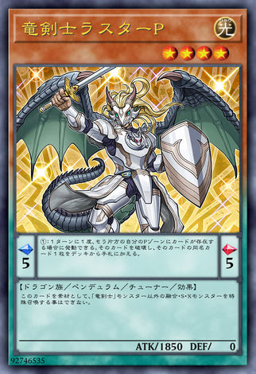

|光|龍族|協調|L4|ATK 1850|DEF 0|
|-|-|-|-|-|-|

效果:
```
擺動刻度：左5右5
擺動效果：
1回合1次，我方另一邊的擺動區域有卡片存在的場合可以發動。
該卡片破壞，從牌組將1張該卡片的同名卡片加入手牌。

怪獸效果：
不能以此卡作為素材，而將「龍劍士」以外的融合、同步、超量怪獸特殊召喚。　
```

魔陷效果先手可以拿來觸發[綠陣](#g_formation)、[宙讀](#astral)、[刻讀](#chorno) 等來幫助展開；後手還可以使用他觸發[紫毒](#purplepoison)來解場，強，目前限一。

再大膽一點 (不怕灰) 可以用他炸[虹彩](#rainbow) 撿 [陣](#format)、炸[黑牙](#blacktooth)復活暗魔法使。 ( 記住，刻度5 - 8 如果之後無法更換，基本上就形同自縊。做上述兩件事情不是很有把握不會被灰，就是已經走投無路了，doing this is the only way to play, QQQQQQ. )

( 抱怨一下，筆者親身試驗，雖然看似很賺，但不知為何每次起手抽他上來伴隨他的其他人都無法跟他起化學效應 (甚麼兩張黑牙一張天空一張虹彩，崩潰)，對筆者而言是張衰小的卡片。 )

本身帶有靈擺字段 (提醒一下，龍劍士/龍魔王許多下怪後綴都有帶個P字，但有很多種P，像是點火騎士、霧動機、威風等等，並不是都代表靈擺，要去看字母上面的拼音才知道)，加上因為超天的關係而可支援異色眼系統，讓他幾乎變成...$\frac{1}{2}$個本家 (差不能直接支援剩下兩個字段) ?

(```SD31-based 魔術師``` 的展開精神就是不斷的炸自己的刻度，所以榮光P的效果其實是符合魔術師本家運作的精神的)


怪獸效果就副作用，只能做龍劍士的 F S X，不能做鮮花、槍管S、深潛、泥睡，在此副牌同步只能用來做暴龍劍士，廢。

**上述兩張為小系統，有人選擇不放(我想是因為水機被禁止，榮光P失去身為協調的最後意義)，有人只放榮光P，有人放3超天1榮光，有人只放各一(筆者是各一)**


<h4 id="formation"> <h4>

## 陣